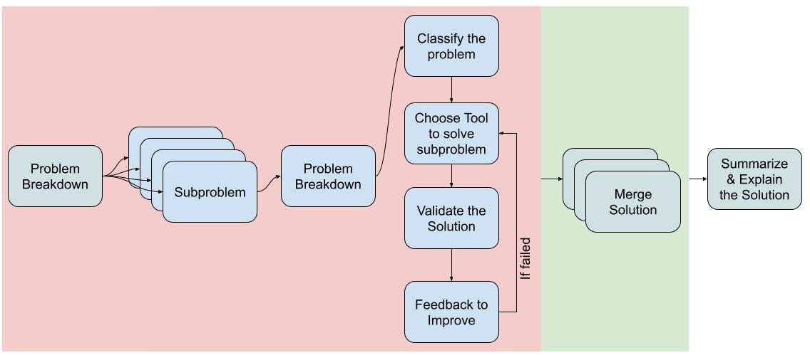
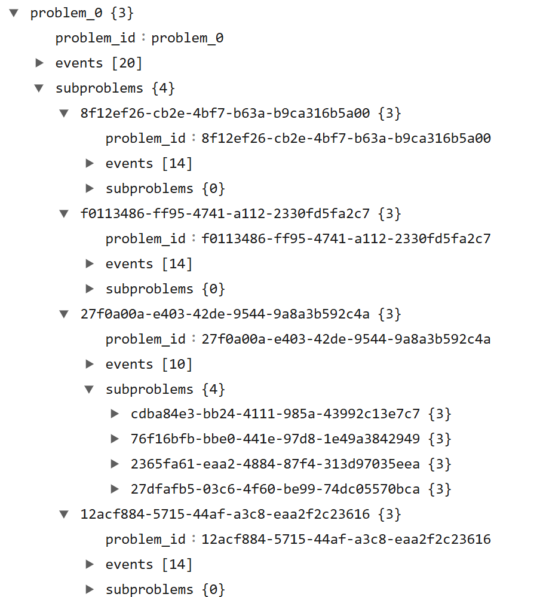

# Message Passing Framework for Recursive Solution of Word-Math Problems

This repository presents a **recursive message-passing framework** that coordinates specialized agents to solve complex word-based math problems by breaking them down into smaller sub-problems. The framework recursively applies agents on each sub-problem, enabling efficient and accurate solutions through adaptive tool selection.

## Overview

1. **Recursive Problem Solving**: Each problem is recursively broken down into smaller sub-problems, enabling finer-grained application of agents at each step. This recursive approach allows for handling complex, multi-step problems by tackling smaller, manageable parts first and then integrating their solutions.

2. **Agent Roles**:
    - **Problem Classification Agent** - Analyzes each sub-problem to determine its type (e.g., algebra, calculus) and recommends the initial tool (Chain of Thought (CoT), or Program-aided Language (PAL)).
    - **Tool Selection Agent** - Chooses the optimal tool based on recommendations and past performance, balancing exploration and exploitation through either randomization or bandit algorithms.
    - **Execution Agent** - Executes the chosen tool for each sub-problem, generating initial solutions that can be further refined.
    - **Feedback Agent** - Validates the solution of each sub-problem, providing feedback and suggesting adjustments or alternative tools if necessary.
    - **Explanation Agent** - Compiles detailed explanations for each step or the final solution, ensuring interpretability and clarity for the user.

The `execution` agent is the main agent that orchestrates the execution of agent calls.

## Key Features

- **Recursive Solution Generation**: Each complex math problem is decomposed into sub-problems. The message-passing agents are then recursively applied to each sub-problem, allowing for precise, step-by-step solutions.
  
- **Adaptive Tool Selection**: Uses an exploration-exploitation strategy (contextual multi-armed bandit algorithms with Thompson Sampling) to select the most suitable tool for each sub-problem. This adaptive selection enhances problem-solving efficiency by learning from feedback.
  
- **Flexible, Modular Architecture**: The framework's agents communicate through a message-passing protocol, allowing dynamic iteration and retooling based on feedback. Each agent’s responsibilities are modular, making it easy to expand the framework with additional tools or more complex recursive logic.

## Contextual Multi-Armed Bandit Tool Selection

It has been observed that different tools have different performance characteristics. Some tools are better at solving certain types of problems, while others are better at solving other types of problems. The contextual multi-armed bandit (C-MAB) algorithm is used to select the most suitable tool for each sub-problem. This adaptive selection enhances problem-solving efficiency by learning from feedback.

The task class classfies the subproblems into different categories, and the C-MAB algorithm is used to select the most suitable tool for each sub-problem. The improves over tiem while solving the subproblems based on the feedbacks provided from the feedback agent.

## Example Workflow

Consider the problem \( x^3 - 6x^2 + 11x - 6 = 0 \):

1. **Recursive Breakdown**: The problem is initially classified as requiring symbolic computation. If a smaller problem within the initial solution is identified (e.g., breaking down polynomial factors), the framework recursively applies agents to solve each factor individually.
2. **Agent Steps**:
    - **Problem Classification Agent** identifies it as an algebraic equation requiring SymPy for root computation.
    - **Tool Selection Agent** confirms the use of SymPy or explores alternatives if the solution requires further breakdown.
    - **Execution Agent** runs SymPy to compute roots, yielding intermediate solutions.
    - **Feedback Agent** verifies the correctness of roots and may suggest further steps if explanations or refinements are needed.
    - **Explanation Agent** provides a clear, recursive breakdown of each factorization step.

3. **Feedback-Driven Iteration**: The Feedback Agent may direct the Tool Selection Agent to switch tools or adjust parameters if initial solutions are incomplete or unclear, recursively refining until each sub-problem converges on an optimal solution.

## Setup

1. create a `.env` to set the environment variables for LLM API key and endpoint
2. update `awms/config.py` to set the model name and endpoint

A problem that is broken down into 4 sub-problems. One of the sub-problems is further broken down into 4 sub-problems. The final solution is the combination of the solutions of the sub-problems.
